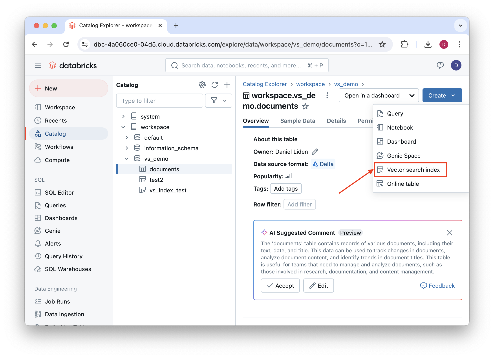
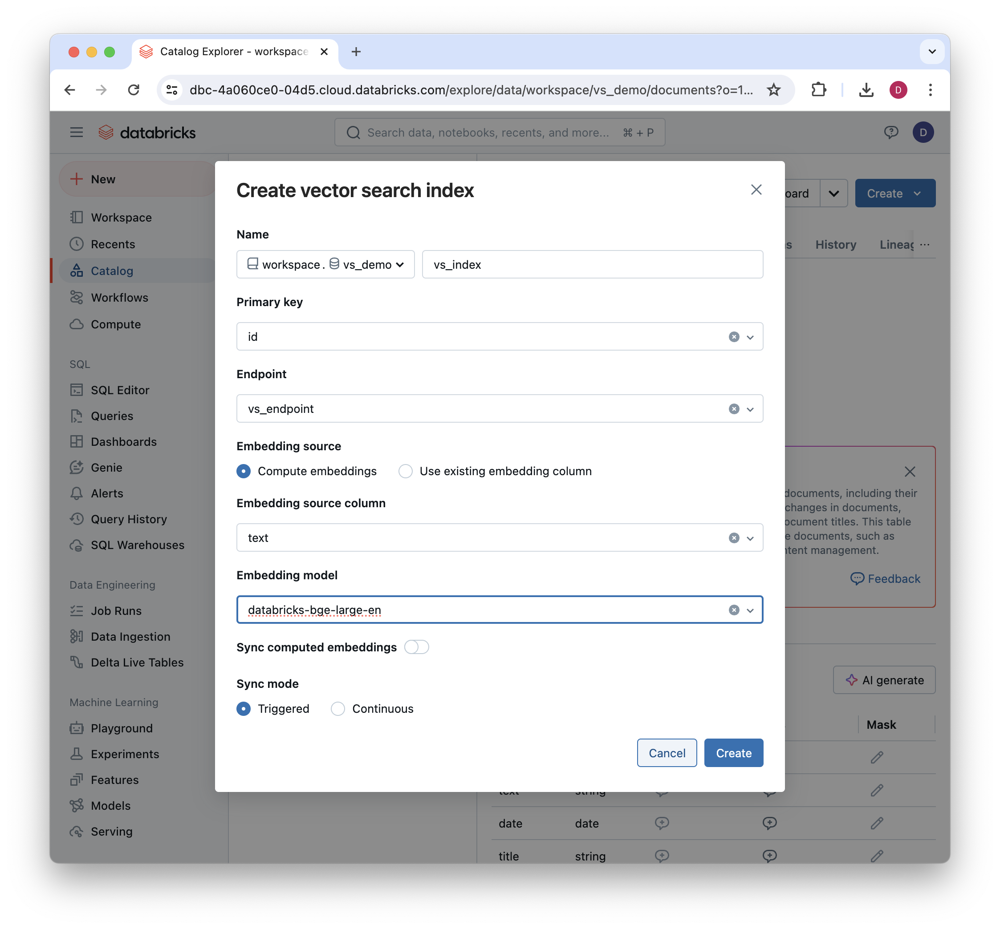
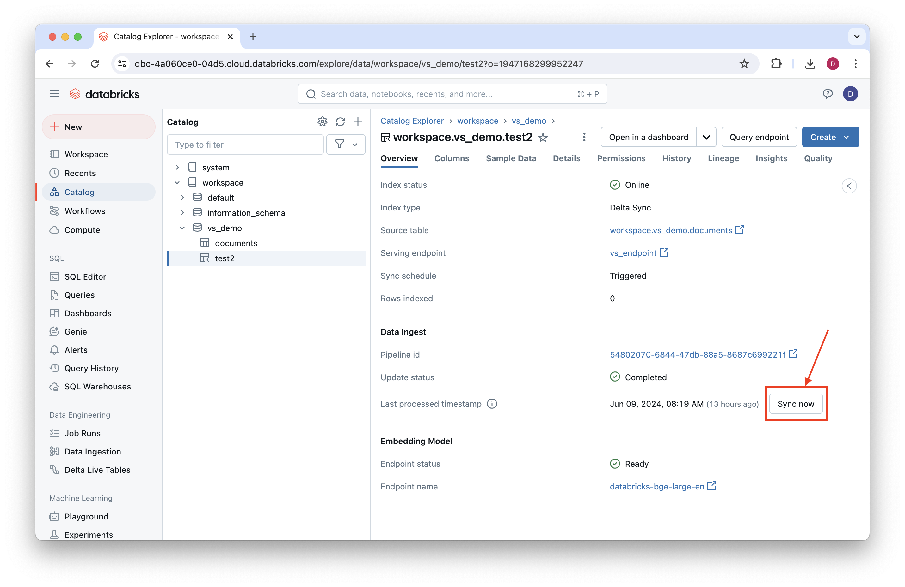
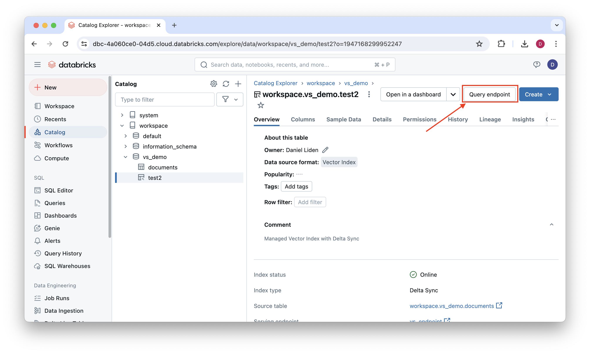

# DAIS 2024 GenAI Workshop and Hackathon

The repo contains a [sample notebook](vector_search_fm_api.ipynb) that demonstrates how to use [Databricks Mosaic AI Vector Search](https://docs.databricks.com/en/generative-ai/vector-search.html) to build a simple RAG application.

Below, we provide example code and UI steps showing how to accomplish the main steps of the notebook. For further details and a more complete implementation, see the [full notebook](vector_search_fm_api.ipynb).

## Demo Components

### 1. Setup

First, we install the necessary libraries and set up the catalog, schema, and table for the demo.

```python
%pip install --upgrade --force-reinstall databricks-vectorsearch databricks-genai-inference
dbutils.library.restartPython()

CATALOG = "workspace"
DB='vs_demo'
SOURCE_TABLE_NAME = "documents"
SOURCE_TABLE_FULLNAME=f"{CATALOG}.{DB}.{SOURCE_TABLE_NAME}"
```

We then create a Delta table for the source data. This is the table that will be indexed for vector search.

```python
from pyspark.sql.types import StructType, StructField, StringType, ArrayType, FloatType
spark.sql(f"CREATE SCHEMA IF NOT EXISTS {CATALOG}.{DB}")
spark.sql(
    f"""CREATE TABLE IF NOT EXISTS {SOURCE_TABLE_FULLNAME} (
        id STRING,
        text STRING,
        date DATE,
        title STRING
    )
    USING delta 
    TBLPROPERTIES ('delta.enableChangeDataFeed' = 'true')
"""
)
```

### 2. Configure the Vector Search Index

We first initialize the vector search client as follows:

```python
from databricks.vector_search.client import VectorSearchClient
vsc = VectorSearchClient()
```

#### 2.1 Create the Vector Search endpoint

Next, we initialize the vector search endpoint. We can do this in Python or via the Databricks UI.

##### Python

```python
vsc.create_endpoint(VS_ENDPOINT_NAME)
```

##### UI

To create a vector search endpoint, first navigate to the "compute" tab in the left navigation menu. Next, click the "Vector Search" tab. Click "create" and then name the endpoint.


#### 2.2 Create the Vector Search Index

Next, we index the source Delta table we created earlier. We can do this in Python or via the Databricks UI.

##### Python

````python
i = vsc.create_delta_sync_index_and_wait(
    endpoint_name=VS_ENDPOINT_NAME,
    index_name=VS_INDEX_FULLNAME,
    source_table_name=SOURCE_TABLE_FULLNAME,
    pipeline_type="TRIGGERED",
    primary_key="id",
    embedding_source_column="text",
    embedding_model_endpoint_name="databricks-bge-large-en"
)
```
For more details on what these specific arguments mean, see the documentation on [how to create and query a Vector Search index](https://docs.databricks.com/en/generative-ai/create-query-vector-search.html).

##### UI

To create the same kind of index using the UI, first navigate to the "catalog" tab in the left navigation menu. Navigate to the table you created earlier. From the "Create" dropdown, click "Vector search index."



Next, configure the index. The following screenshot shows how to configure the index in the same way as in the Python example above using the UI.



### 3. Add some data and sync the index

Once we've create the index, we can add some data to the source Delta table we created at the beginning, and then sync it with the index. For an example of adding some sample data, see the [full notebook](vector_search_fm_api.ipynb).

You can sync the index with the Python client or via the Databricks UI.

Sync the index in Python with:

```python
index = vsc.get_index(endpoint_name=VS_ENDPOINT_NAME,
                      index_name=VS_INDEX_FULLNAME)
index.sync()
```

To sync the index using the UI, first navigate to the "catalog" tab in the left navigation menu. Navigate to the location you specified for the index. Select the index, and click "Sync now."



### 4. Query the index

You can query the index with the Python client with the `index.similarity_search()` method:

```python
index.similarity_search(columns=["text", "title"],
                        query_text="What is the TDR Target for the SMARTER initiative?",
                        num_results = 3)
```

You can also query the index directly or get `curl` or `python` code for querying the index via the UI. To do so, navigate to your index as in the previous step and click "Query endpoint".



### 5. RAG: Bring in an LLM

Lastly, we can pass the retrieved responses to an LLM to get informed answers about the retrieved content. Here's a very simple approach to this in Python:

```python
from databricks_genai_inference import ChatSession

# reset history
chat = ChatSession(model="databricks-meta-llama-3-70b-instruct",
                   system_message="You are a helpful assistant. Answer the user's question based on the provided context.",
                   max_tokens=128)

# get context from vector search
raw_context = index.similarity_search(columns=["text", "title"],
                        query_text="What is the TDR Target for the SMARTER initiative?",
                        num_results = 3)

context_string = "Context:\n\n"

for (i,doc) in enumerate(raw_context.get('result').get('data_array')):
    context_string += f"Retrieved context {i+1}:\n"
    context_string += doc[0]
    context_string += "\n\n"

chat.reply(f"User question: What is the TDR Target for the SMARTER initiative?\n\nContext: {context_string}")
chat.last
```

Now you have the basic tools for making a simple RAG application with Databricks Mosaic AI Vector Search and the Foundation Model APIs! For a more detailed walkthrough, see the [full notebook](vector_search_fm_api.ipynb).